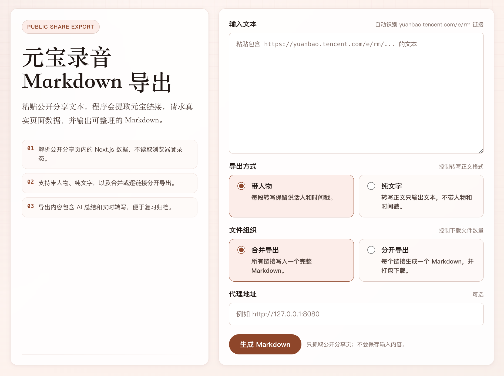

# Yuanbao Route Export

轻量 Python WebUI，用于从腾讯元宝公开录音分享链接导出 Markdown 文档。
用于期末复习批量导出日常没听的课程。

> 非腾讯官方项目。只处理用户主动输入的公开分享链接，不保存输入内容和导出内容。

## 截图

以下截图只展示本地 WebUI 的接入界面，不包含任何个人链接、录音内容或导出内容。



## 功能

- 从任意粘贴文本中提取 `https://yuanbao.tencent.com/e/rm/...` 链接。
- 直接请求公开分享页，解析页面真实 `__NEXT_DATA__` 数据。
- 导出两种 Markdown：
  - 带人物：保留说话人和时间戳。
  - 纯文字：只保留转写文字。
- 支持两种文件组织：
  - 合并导出：所有链接写入一个完整 Markdown。
  - 分开导出：每个链接生成一个 Markdown，WebUI 中以 zip 下载。
- 同一份导出中包含 AI 总结和实时转写。

## 安装

```bash
python3 -m venv .venv
. .venv/bin/activate
pip install -r requirements.txt
```

## 启动 WebUI

```bash
python app.py
```

默认地址：`http://127.0.0.1:5001`

如需指定端口：

```bash
PORT=5010 python app.py
```

## 命令行导出

```bash
python -m yuanbao_exporter.cli --mode with-speakers --output exports/with_speakers.md < links.txt
python -m yuanbao_exporter.cli --mode plain-text --output exports/plain_text.md < links.txt
python -m yuanbao_exporter.cli --layout separate --mode plain-text --output exports/separate < links.txt
python -m yuanbao_exporter.cli --layout separate --mode with-speakers --output exports/separate.zip < links.txt
```

如果网络环境需要代理：

```bash
YUANBAO_PROXY_URL=http://127.0.0.1:8080 python -m yuanbao_exporter.cli --mode plain-text --output exports/plain_text.md < links.txt
```

## 测试

```bash
pip install -e ".[dev]"
pytest
```

## 免责声明

- 本项目仅用于学习、备份和整理用户有权访问的公开分享内容。
- 使用者应自行确认录音、转写、总结内容的版权、隐私和使用授权。
- 本项目不提供绕过登录、权限控制、付费墙或访问限制的能力。
- 本项目与腾讯元宝、腾讯公司无官方关联。
- 如本项目内容、名称、截图或实现方式侵犯了你的合法权益，请通过 GitHub Issue 联系作者；确认后将及时删除或调整相关内容。

## 许可

本项目采用仓库内 [LICENSE](LICENSE) 所述的宽松许可：允许使用、复制、修改、分发和商业使用；商业化使用需要通知作者。软件按现状提供，不提供任何明示或暗示担保。
